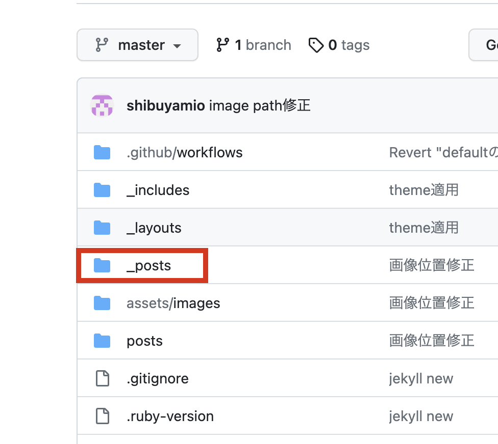
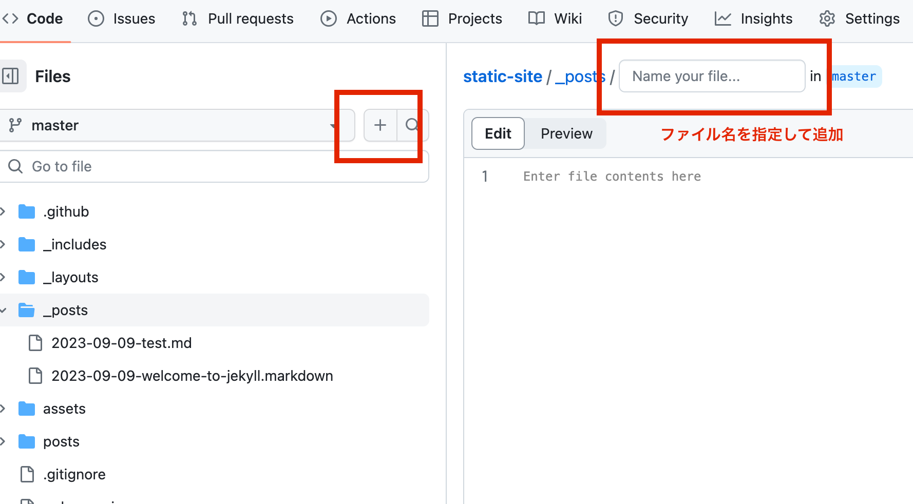
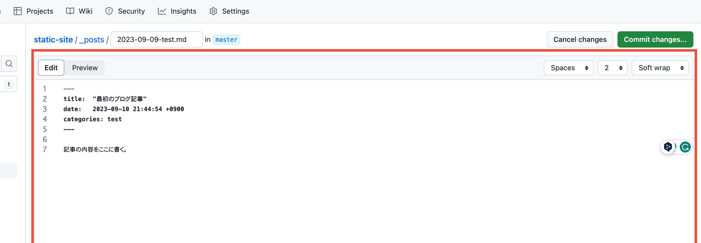
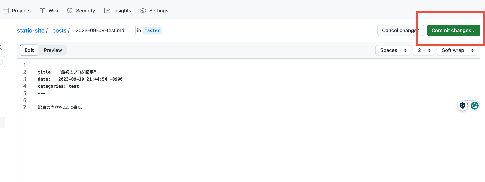
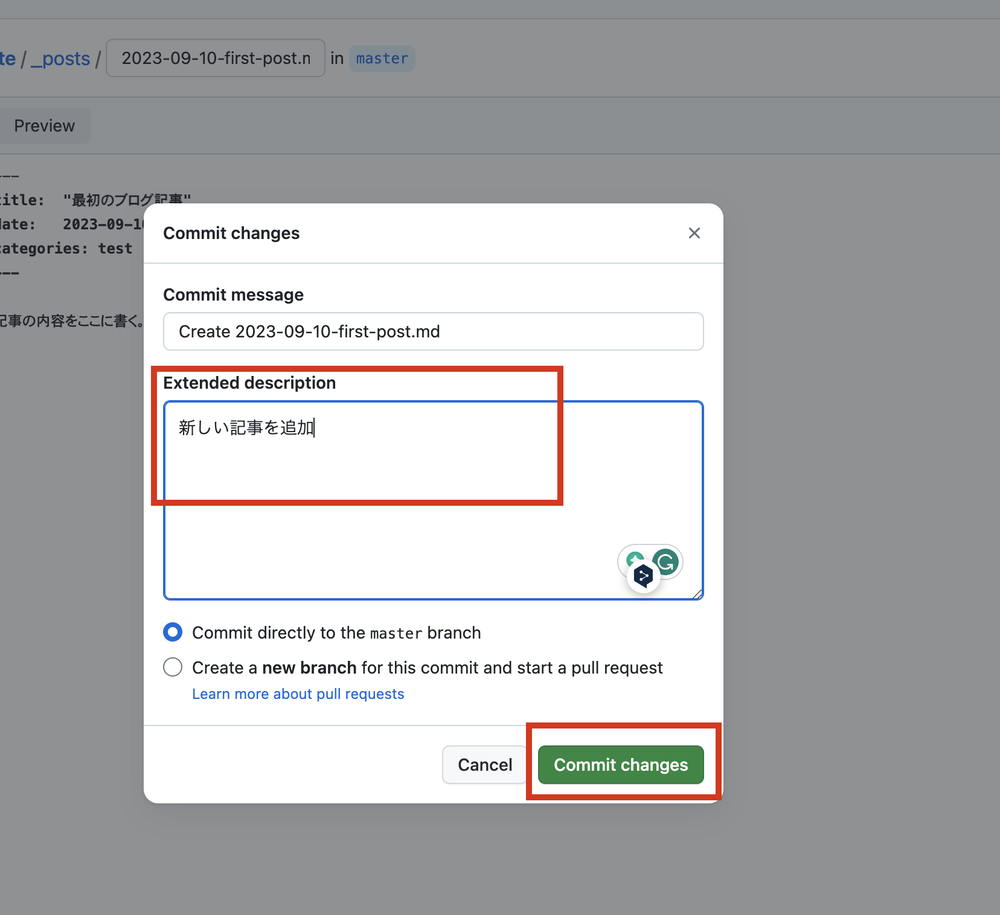

# 練習用サイト

GitHub Pagesを使ったWebサイトのサンプルとして作成しました。

## 概要

サイトはこちら (https://shibuyamio.github.io/static-site/)で公開されています。

以下の手順でGithubを更新することで、サイトを更新することができます。

### GitHub Pages

GitHubはプログラム開発を行う際などに、ソースコードやテキストファイルなどの情報を管理することのできるサービスです。

コードやテキストは厳密にバージョン管理されて、GitHubのサービス上で保管されます。

GitHub pagesは、GitHub上で管理されているコードやテキストを、Webサイト（ホームページ）として公開することができます。

このサンプルでは、GitHubでコンテンツの管理を行い、GitHub PagesでWebサイトを公開します。

GitHub, GitHub Pages共に無料で利用することができます。このサンプルは無料サービスの範囲でサイトを公開しています。

### GitHub Pagesでサイトを公開する利点

GitHub PagesはシンプルなHTMLとスタイルシート、JavaScriptを公開することができます。

PHPなどを使用しないシンプルなHTMLによるWebサイトはセキュリティが高く、表示速度が早い特徴があります。

Github PagesはHTTPSで提供されており、お名前.comなどで契約したドメイン（xxx.comなど）を利用することもできます。

一ヶ月あたりのダウンロード帯域が100GBを越えると制限がかかりますので注意してください。


## 更新方法

`_posts` ディレクトリにテキストファイルを追加することで、サイトのページ（ブログ投稿）を追加することができます。

### ページ追加方法



`_posts` フォルダをクリックし、右上の「＋」ボタンを押して、ファイルを追加します。

※ `posts` フォルダと `_posts` フォルダがあるので区別に注意してください。

### ファイル名の指定



ファイル名を指定する入力欄が表示されるので、英数字でファイル名を入力します。

ファイル名はブログを追加したい日付で開始してください。 また、ファイル名の最後は `.md` としてください。

`YYYY-MM-dd-title.md` の形式になります。

例： `2023-09-10-first-post.md`


ファイル名を入力したら、下部の編集フォームに追加するコンテンツの内容を入力してください。

### コンテンツ冒頭の指定

コンテンツの内容は自由ですが、書き方にいくつか決まりがあります。

冒頭には以下の内容を記入してください。

```markdown
---
title:  "最初のブログ記事"
date:   2023-09-10 21:44:54 +0900
categories: test
---
```

`title: `に続けて、記事のタイトルを入力してください。

`date: `に続けて、記事の更新日時を入力してください。

`categories: `に続けて、記事のカテゴリを入力してください。ここでは `test`と入力しています。

カテゴリは自由に作成することができます。好きな文字列を入れてください。

※ `:`の後に空白 ` ` があることに注意してください。


以下のようになります。



### コンテンツ内容の記述

コンテンツは `markdown` という記述方法で記述します。

詳しい記述方法は以下を参照してください。

https://docs.github.com/ja/get-started/writing-on-github/getting-started-with-writing-and-formatting-on-github/basic-writing-and-formatting-syntax


基本的には、普通のテキストの書き方で記述できます。

改行する時は1行開けてください。

```markdown
最初の段落。この行は改行されません。
最初の段落の続き。
二番目の段落
```

見出しは冒頭に `#`をつけます。

```markdown

# これは最初の見出し

## これは二番目の見出し

これは普通の文
```

### 新しいページの保存

Githubで新しいファイルを保存して追加する場合は、`Commit` を行います。

右上の `Commit changes...` ボタンをクリックします。



ダイアログが表示されるので、変更内容にメモを追記して、 `Commit Changes` ボタンをクリックします。




### サイトの更新

以上で更新手順は終わりです。

更新には1~5分くらいかかります。

サイト（https://shibuyamio.github.io/static-site/)にアクセスしてリロードしてみると、サイトに新しいページが追加されています。

